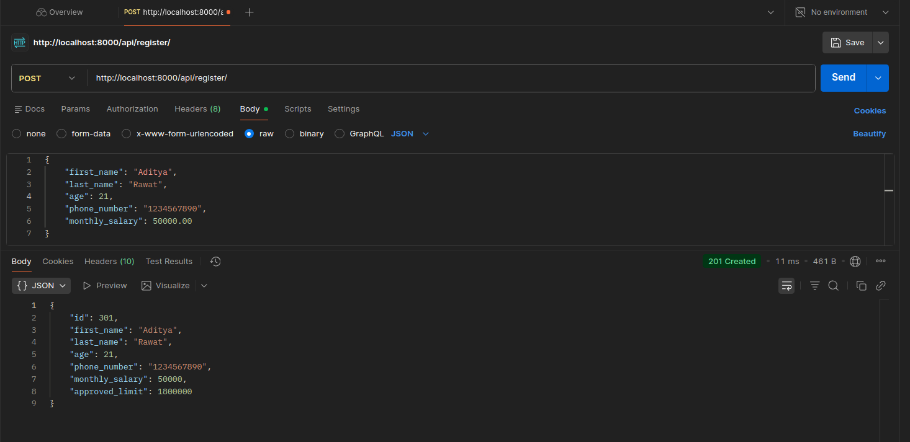
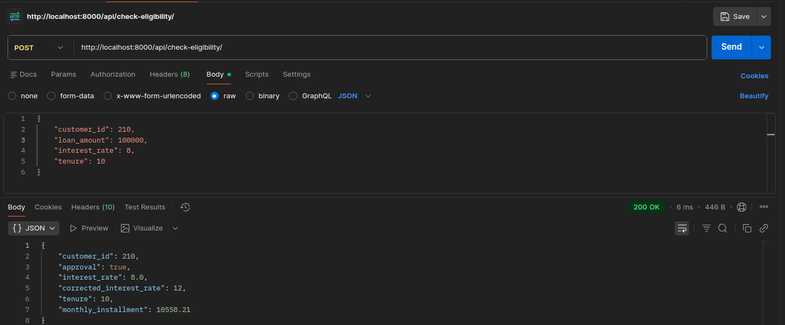
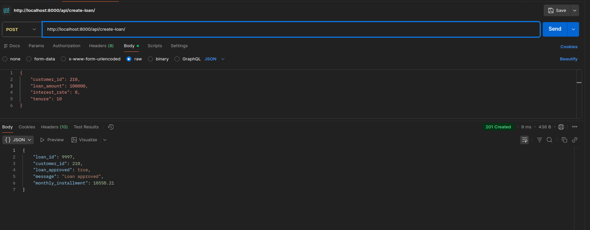
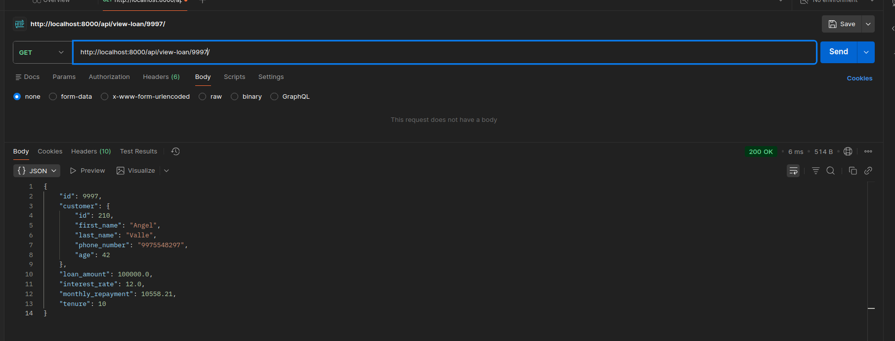
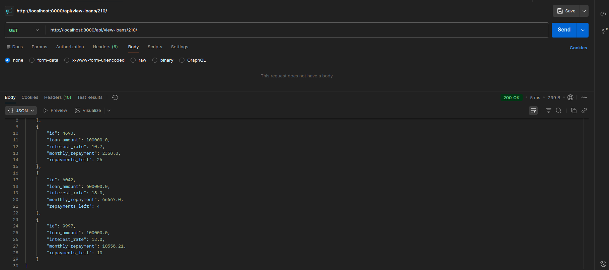

# Credit Approval System (Backend)

Django + DRF backend that evaluates loan eligibility and manages customer loans using historical Excel data.

---

## Run (Docker)

```bash
docker compose up --build
```

This will:

- Start PostgreSQL
- Apply migrations
- Ingest Excel datasets
- Start the API server

Base URL:

```
http://localhost:8000/
```

---

## Endpoints

- **POST** `/api/register/`

- **POST** `/api/check-eligibility/`

- **POST** `/api/create-loan/`

- **GET** `/api/view-loan/<loan_id>/`

- **GET** `/api/view-loans/<customer_id>/`

---

## Key Implementation Notes

- `current_debt` is **not stored statically** and is **calculated dynamically** during `/check-eligibility`.
- Some dataset rows contained **duplicate loan IDs**. Duplicate conflicting entries were ignored to maintain unique loan records.
- Some loans had `emis_paid_on_time > tenure`. The system safely handles this using `min(emis_paid_on_time, tenure)`.
- EMI for new loans is calculated using the **compound interest formula**.
- Data ingestion is **idempotent** (`ignore_conflicts=True`).

---

## Running Tests

```bash
docker compose exec web python manage.py test
```
or Locally:
1. create the venv with:
```bash
uv sync
```
2. Activate the virtual env :
- for linux:
```bash
source .venv/bin/activate
```
- for windows:
```bash
source .venv/Scripts/activate
```
3. Then run the test:
```bash
python manage.py test
```
---

## Tech Stack

- Django + DRF
- PostgreSQL (Docker)
- Pandas
- Docker Compose


## Project Structure
```
.
├── credit_system/           Django project configuration (settings, urls, wsgi)
├── loans/                   Core app: models, views, serializers, utils, tests, ingestion command
├── data/                    Provided Excel datasets used for initial ingestion
├── Dockerfile               Docker image definition for the Django service
├── docker-compose.yml       Orchestrates Django app + PostgreSQL
├── manage.py                Django management entry point
├── requirements.txt         Python dependencies used in the container
├── pyproject.toml           Project dependency configuration (uv)
├── uv.lock                  Locked dependency versions for reproducible installs
├── .gitignore               Excludes local/dev artifacts from git
└── README.md                Project documentation
```